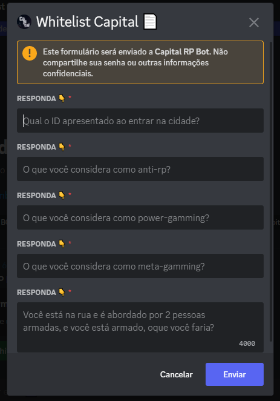
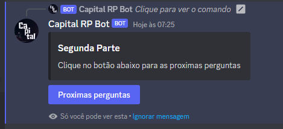
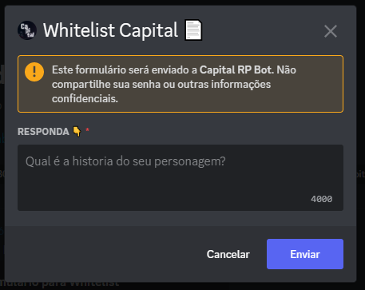
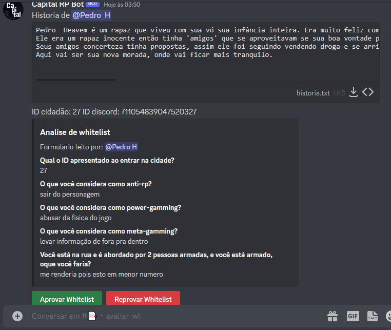
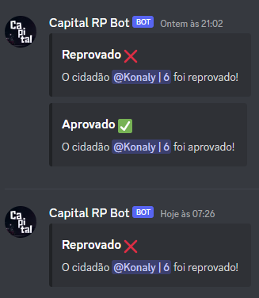
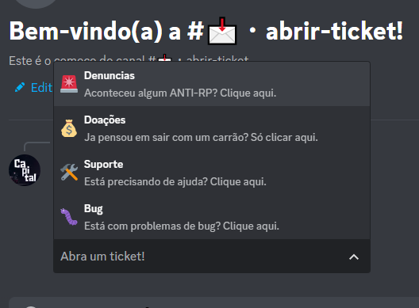
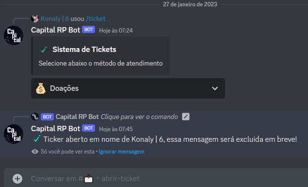

# Bot de discord em python 
## Sistema de whitelist e sistema de tickets
## integração com banco de dados
 

 Sistema de Whitelist

    
    
    
    
    
    
    

 
 
 

 Sistema de Tickets

    
    
    
    
    

### Tecnologias usadas 💻

